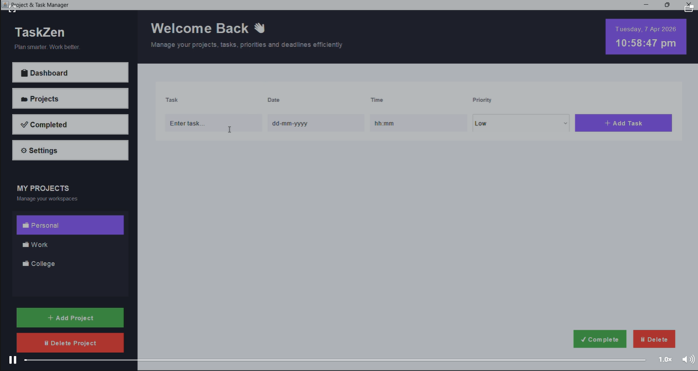
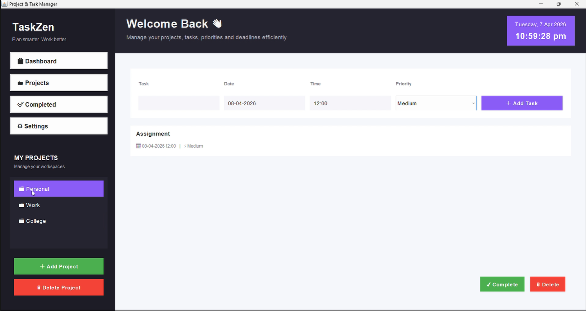
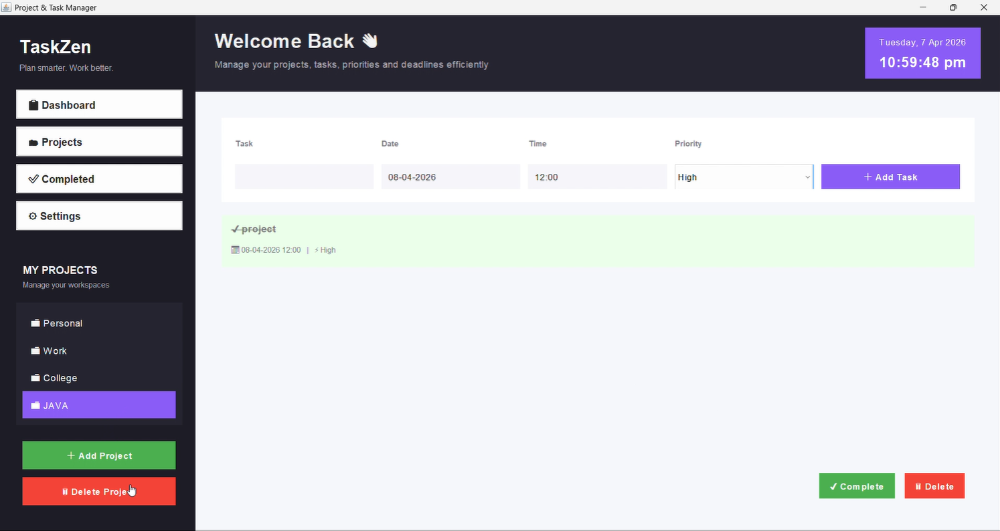

# TaskZen – Project & Task Management Application

TaskZen is a **Java Swing-based desktop application** developed to help users efficiently manage **projects, tasks, deadlines, and priorities** through a clean, organized, and interactive dashboard interface.

This project was created as an **academic mini project / internal submission** to demonstrate the practical implementation of **Java GUI development**, **Object-Oriented Programming (OOP)**, modular architecture, and event-driven programming.

---

## 📸 Demo

<p align="center">
  
</p>

<p align="center">
  
</p>

<p align="center">
  
</p>

---

## 📌 Project Overview

TaskZen provides a centralized workspace where users can:

- Create and manage multiple **projects**
- Add and organize **tasks** under each project
- Assign **deadlines**
- Set **priority levels**
- Mark tasks as **completed**
- Delete tasks and projects
- View work in a structured and user-friendly interface

The application follows a **modular design approach**, separating:

- **User Interface**
- **Business Logic**
- **Data Models**

This improves the project's **readability, maintainability, and scalability**.

---

## 🎯 Objectives

The primary objectives of this project are:

- To develop a **desktop-based Task Management System**
- To implement a **GUI application using Java Swing**
- To demonstrate **project-wise task organization**
- To apply **Object-Oriented Programming concepts**
- To implement essential task management operations such as:
  - Add Task
  - Delete Task
  - Complete Task
  - Add Project
  - Delete Project
- To create a **clean and professional dashboard-style user interface**

---

## ✨ Features

### 1. Project Management
- Create multiple projects
- Delete selected projects
- Load tasks dynamically for the selected project

### 2. Task Management
- Add tasks under a selected project
- Enter:
  - Task title
  - Date
  - Time
  - Priority
- Delete selected tasks
- Mark selected tasks as completed

### 3. Task Properties
Each task stores:
- **Title**
- **Deadline**
- **Priority**
- **Completion Status**

### 4. Priority Levels
Tasks can be assigned one of the following priority levels:
- **Low**
- **Medium**
- **High**

### 5. Completion Tracking
Completed tasks are visually distinguished using:
- ✔ Completion indicator
- Strikethrough text
- Completion status tracking

### 6. Interactive Dashboard UI
The application includes:
- Sidebar navigation panel
- Project workspace panel
- Task management panel
- Live date and time display
- Modern dashboard-inspired layout

---

## 🛠️ Technologies Used

| Technology | Purpose |
|-----------|---------|
| **Java** | Core programming language |
| **Java Swing** | GUI development |
| **AWT** | Layouts, fonts, colors, and rendering |
| **OOP Concepts** | Encapsulation, abstraction, modularity |
| **Event Handling** | User interaction and action management |

---

## 🧱 Project Structure

```bash
TaskZen/
│
├── main/
│   └── Main.java
│
├── model/
│   ├── Project.java
│   └── Task.java
│
├── service/
│   └── TaskService.java
│
├── ui/
│   ├── MainFrame.java
│   ├── ProjectPanel.java
│   └── TaskPanel.java
│
├── 1.png
├── 2.png
├── 3.png
└── README.md

---

📂 Module Description
1. main Package
Main.java

This is the entry point of the application.

Responsibilities:

Launches the GUI using SwingUtilities.invokeLater()
Initializes the main application window
Ensures safe execution on the Event Dispatch Thread (EDT)
2. model Package

This package contains the data model classes used in the application.

Project.java

Represents a project that contains:

Project name
List of tasks

Functions include:

Add task
Delete task
Get task list
Count completed and pending tasks
Task.java

Represents an individual task with:

Task title
Deadline
Priority
Completion status

Functions include:

Mark task as completed
Mark task as pending
Access and modify task details
3. service Package
TaskService.java

This is the business logic layer of the application.

Responsibilities:

Manage all projects
Add and delete projects
Add and delete tasks
Mark tasks as completed
Fetch tasks for the selected project
Maintain task counts

This class acts as the bridge between:

UI Layer
Data Models
4. ui Package

This package contains all graphical user interface components.

MainFrame.java

The main application window.

Responsibilities:

Builds the dashboard layout
Integrates:
ProjectPanel
TaskPanel
Displays:
App title
Welcome section
Live date and time
ProjectPanel.java

Responsible for managing project-related operations.

Features:

Display available projects
Add new projects
Delete existing projects
Update task view on project selection
TaskPanel.java

Responsible for task-related operations.

Features:

Add new tasks
Set:
Title
Date
Time
Priority
Display tasks in list format
Delete tasks
Mark tasks as completed

This panel serves as the main working area of the application.

🖥️ User Interface Design

The application follows a dashboard-style desktop interface to provide a cleaner and more modern user experience.

UI Components Included
Sidebar navigation
Project workspace list
Task input form
Task list display
Action buttons
Date and time card
Custom fonts, colors, spacing, and layouts
Design Goals
Clean layout
Easy navigation
Better visual hierarchy
Improved user experience compared to a default Swing application
⚙️ Working of the Application
Step 1 – Launch the Application

When the application starts:

The main window opens
Default projects are displayed:
Personal
Work
College
Step 2 – Select a Project

The user selects a project from the sidebar.

Once selected:

Tasks belonging to that project are loaded into the main panel
Step 3 – Add a Task

The user enters:

Task name
Date
Time
Priority

Then clicks Add Task.

The task is added under the selected project.

Step 4 – Manage Tasks

The user can:

Select a task
Mark it as completed
Delete it if needed
Step 5 – Manage Projects

The user can:

Add a new project
Delete an existing project
🔄 Application Workflow
User Action
   ↓
UI Layer (Swing Panels)
   ↓
TaskService (Logic Handling)
   ↓
Project / Task Models
   ↓
Updated UI Display
🧠 Concepts Applied

This project demonstrates the practical implementation of the following concepts:

Core Java Concepts
Classes and Objects
Constructors
Packages
Lists / Collections
Access Modifiers
Method Design
Object-Oriented Programming Concepts
Encapsulation
Modularity
Separation of Concerns
Reusability
GUI Programming Concepts
Swing Components
Layout Managers
Event Listeners
Custom Rendering
UI Styling
🚀 How to Run the Project
Requirements

Make sure the following are installed:

Java JDK 8 or above
Any Java IDE such as:
IntelliJ IDEA
Eclipse
NetBeans
VS Code (with Java extensions)
Steps to Run
Clone the repository
git clone https://github.com/shriabiju/task-manager.git
Open the project in your preferred Java IDE
Navigate to
main/Main.java
Run Main.java
▶️ Default Projects

When the application launches, the following sample projects are available by default:

Personal
Work
College

These can be used immediately for testing and demonstration.

📈 Future Enhancements

This project can be further improved by adding:

File / database storage for persistent data
Task editing functionality
Project rename / edit option
Search and filter features
Progress tracking / analytics
Calendar picker for date input
Notifications / reminders
Dark / Light theme toggle
Login system
Export tasks to file

These enhancements can make the application more aligned with real-world productivity tools.

✅ Advantages
Easy to use
Clean and organized dashboard
Supports project-wise task management
Demonstrates practical Java GUI development
Suitable as an academic mini project
Modular and extendable code structure
⚠️ Limitations

Current limitations of the project include:

Data is stored only in memory during runtime
No file/database persistence
No user authentication
No task editing functionality yet
Date and time are entered manually

These limitations are acceptable for a mini project and can be improved in future versions.

📚 Learning Outcomes

Through this project, the following outcomes were achieved:

Understanding Java Swing-based desktop application development
Applying OOP concepts in a practical project
Designing modular Java applications
Implementing event-driven user interfaces
Building a complete GUI-based management system
👩‍💻 Authors
Shria Biju
Shwet Singh

VIT Bhopal University

📄 License

This project is developed for academic and educational purposes only.